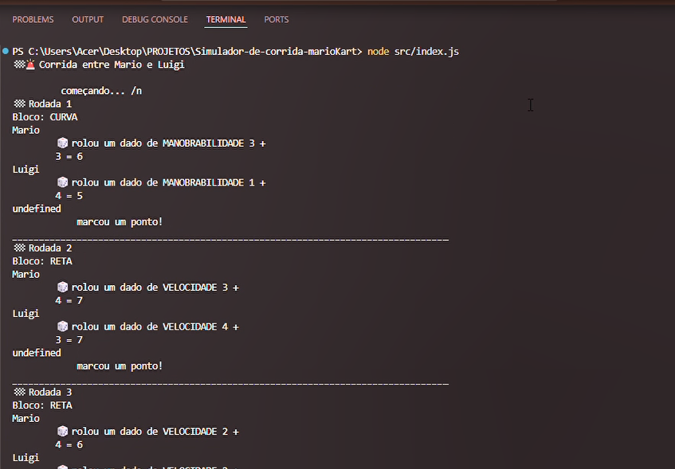

## 🏎️ Sobre o Projeto  

# 🏁 Olá! Este é um projeto de um **simulador de corrida do Mario Kart**. 

Bem-vindo ao **simulador de corrida do Mario Kart**, um jogo inspirado na clássica franquia da Nintendo,  
desenvolvido com **JavaScript** e **Node.js**.   

Neste projeto, o objetivo foi recriar uma experiência  divertida com foco de melhorar meus conhecimentos 
 em  para tornar o jogo mais dinâmico e interativo.   

Ele foi desenvolvido como parte de um curso de , com o objetivo de ser algo simples, mas que contribuisse para o meu aprendizado. 

A proposta principal era **explorar conceitos fundamentais** de programação e lógica em um contexto divertido, ao mesmo tempo em que praticava o uso de JavaScript em um ambiente mais aplicado.  

---

## 🎮 Demonstração

## 🚀 Tecnologias Utilizadas

